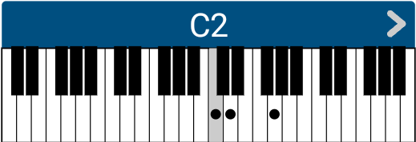

# iRealPro
[戻る](./README.md)  
コード記号は、63通りあり、「∆」は「^」に、「♭」は「b」に、など一部は置き換えられるものの、ほぼ表記どおりに文字入力すればよい。

## 1.コード記号一覧

|No.|ボタン|iRealPro記法例|読み方|Piano|構成音|
|---|---|---|---|---|---|
|1|5|C5|パワーコード||1,P5|
|2|2|C2|||1,M2,P5|
|3|add9|Cadd9|アドナイン||1,M3,P5,M9|
|4|+|C+|オーグメント||1,M3,♯5|
|5|o|Co|ディミニッシュ||1,m3,♭5|
|6|ø|Cø|ハーフディミニッシュ||1,m3,♭5,m7|
|7|sus|Csus|サスフォー||1,P4,P5|
|8|∆|C^|メジャーセブン||1,M3,P5,M7|
|9|-|C-|マイナー||1,m3,P5|
|10|∆7|C^7|メジャーセブン||1,M3,P5,M7|
|11|-7|C-7|マイナーセブン||1,m3,P5,m7|
|12|7|C7|セブン||1,M3,P5,m7|
|13|7sus|C7sus|セブンサスフォー||1,P4,P5,m7|
|14|ø7|Cø7|ハーフディミニッシュセブン||1,m3,♭5,m7|
|15|o7|Co7|||
|16|o∆7|Co^7|||
|17|∆9|C^9|||
|18|∆13|C^13|||
|19|6|C6|||
|20|6/9|C69|||
|21|∆7♯11|C^7♯11|||
|22|∆9♯11|C^9♯11|||
|23|∆7♯5|C^7♯5|||
|24|-6|C-6|||
|25|-6/9|C-69|||
|26|-∆7|C-^7|||
|27|-∆9|C-^9|||
|28|-9|C-9|||
|29|-add9|C-add9|||
|30|-11|C-11|||
|31|-7♭5|C-7b5|||
|32|ø9|Cø9|||
|33|-♭6|C-b6|||
|34|-♯5|C-♯5|||
|35|9|C9|||
|36|7♭9|C7b9|||
|37|7♯9|C7♯9|||
|38|7♯11|C7♯11|||
|39|7♭5|C7b5|||
|40|7♯5|C7♯5|||
|41|9♯11|C9♯11|||
|42|9♭5|C9b5|||
|43|9♯5|C9♯5|||
|44|7♭13|C7b13|||
|45|7♯9♯5|C7♯9♯5|||
|46|7♯9♭5|C7♯9b5|||
|47|7♯9♯11|C7♯9♯11|||
|48|7♭9♯11|C7b9♯11|||
|49|7♭9♭5|C7b9b5|||
|50|7♭9♯5|C7b9♯5|||
|51|7♭9♯9|C7b9♯9|||
|52|7♭9♭13|C7b9b13|||
|53|7alt|C7alt|||
|54|13|C13|||
|55|13♯11|C13♯11|||
|56|13♭9|C13b9|||
|57|13♯9|C13♯9|||
|58|7♭9sus|C7b9sus|||
|59|7susadd3|C7susadd3|||
|60|9sus|C9sus|||
|61|13sus|C13sus|||
|62|7♭13sus|C7b13sus|||
|63|11|C11|||
  
[戻る](./README.md) 