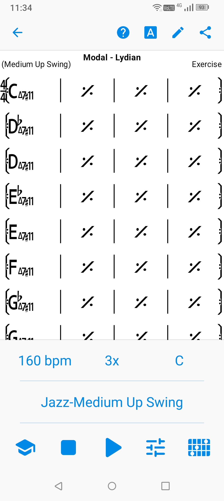
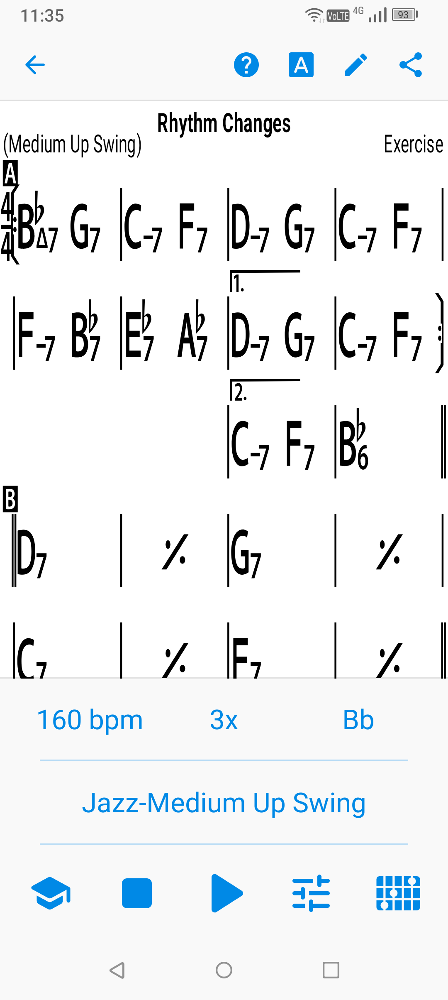

# iRealPro
[戻る](./README.md)  
まずはライブラリーにある曲を再生してみると、各記号の使い方の参考になります。

## 1.繰り返し記号
|No.|曲名|images|Memo|
|---|---|---|---|
|1|Afro 1|||
|2|Afro 2||1|
|3|Ballad 1||1|
|4|Ballad 2||1|
|5|Ballad 3||1|
|6|Blues - Bird||1|
|7|Blues - Jazz||1|
|8|Blues - Minor||1|
|9|Blues - Minor Waltz||1|
|10|Blues - Simple||1|
|11|Blues - Sus||1|
|12|Blues - Waltz||1|
|13|Bossa 1||1|
|14|Bossa 2||1|
|15|Bossa 3||1|
|16|Dominant 7 Workout||1|
|17|Dominant 7#11 Workout||1|
|18|Dominant 7alt Workout||1|
|19|Even 8ths 1||1|
|20|Even 8ths 2||1|
|21|Even 8ths 3||1|
|22|Fast Jazz 1||1|
|23|Fast Jazz 2||D.S. al 2nd ending|
|24|Fast Jazz 3||1|
|25|Ⅱ-Ⅴ-Ⅰ in 12 Major Keys||1|
|26|Ⅱ-Ⅴ-Ⅰ in 12 Minor Keys||1|
|27|Jazz Waltz 1||1|
|28|Jazz Waltz 2||D.S. al 2nd ending|
|29|Jazz Waltz 3||1|
|30|Medium Jazz 1||1|
|31|Medium Jazz 2||1|
|32|Medium Jazz 3||1|
|33|Modal - Aeolian||1|
|34|Modal - Dorian||1|
|35|Modal - Herbs||1|
|36|Modal - Lydian||1|
|37|Modal - Miles||1|
|38|Odd Meter 11-4||1|
|39|Odd Meter 5-4||1|
|40|Odd Meter 7-4||1|
|41|Odd Meter 7-8||1|
|42|Odd Meter 9-4||1|
|43|Rhythm Changes||1|
|44|Rock 1||1|
|45|Rock 2||1|
|46|Rock 3||1|
|47|Tonal Cycle of 5ths in 12 Keys||1|
|48|Trane Changes 1||1|
|49|Trane Changes 2||1|
|50|Trane Changes 3||1|

[戻る](./README.md)  