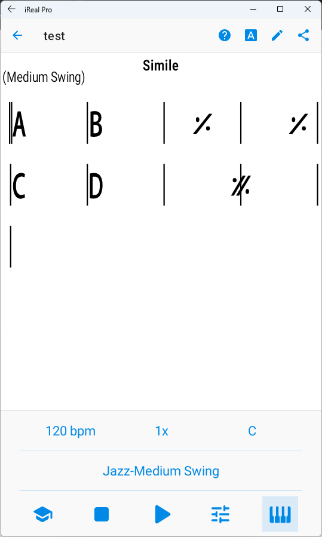
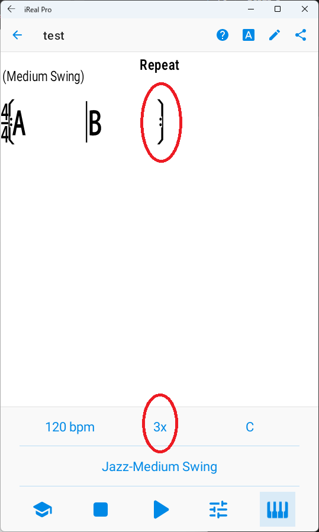
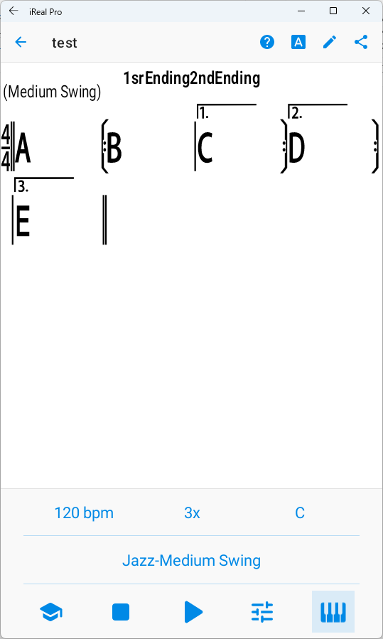
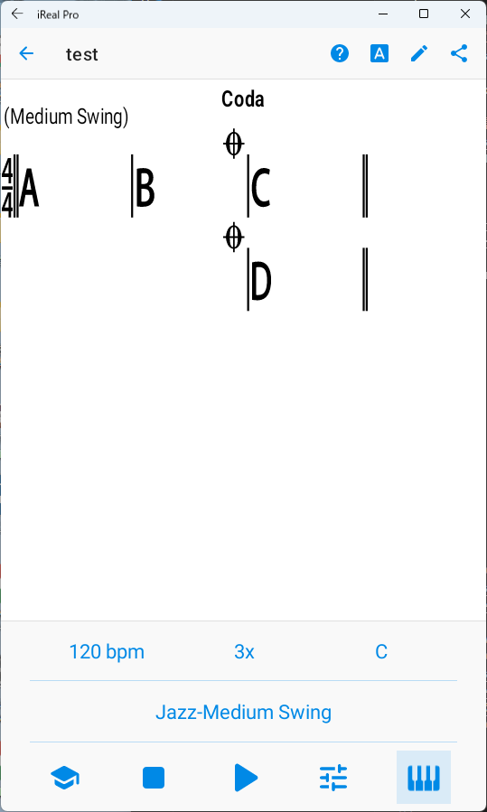
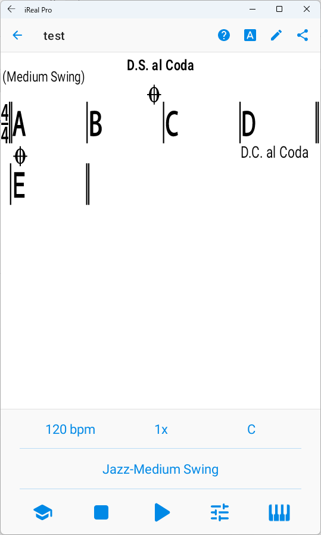
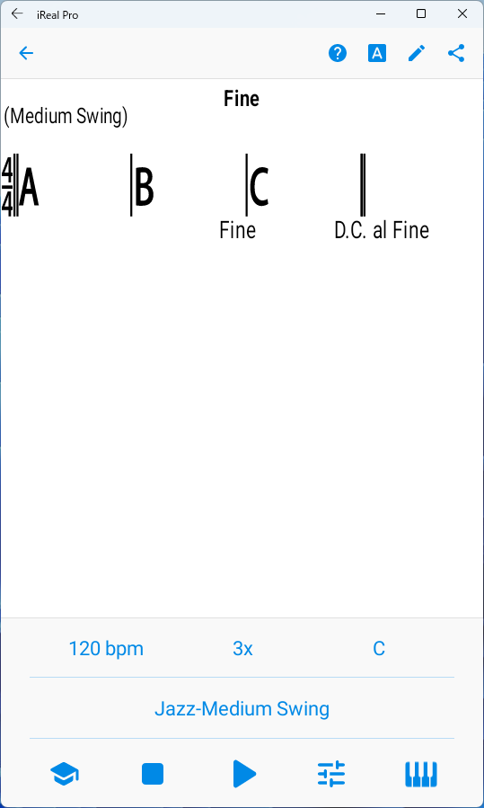

# iRealPro
[戻る](./README.md)  
繰り返し記号を使えば、楽譜が簡潔になり、暗譜もしやすくなる。

## 1.繰り返し記号
|No.|ボタン|メモ|
|---|---|---|
|1|┌1.|1回目だけ、反復記号（右）まで進んで、曲の最初または反復記号（左）まで戻る。|
|2|┌2.|2回目に┌1.のところにきたら、ここまで飛ぶ。|
|3|┌3.|3回目に┌1.のところにきたら、ここまで飛ぶ。|
|4|coda|１回目は素通りし、リピートやダ・カーポ、ダル・セーニョで戻ったあと、２回目にここまで来たら、次のヴィーデ（vide）またはコーダ（集結部）まで飛ぶ。|
|5|segno|ダル・セーニョで、ここまで戻る|
|6|fermata|「D.C.」や「D.S.」で戻ったあと、演奏終了。「Fine」と、「複重線上のフェルマータ」は同じ意味。|
|7|END||
|8|D.C. al Coda|曲の最初まで戻ってコーダで飛ぶ|
|9|D.C. al Fine|曲の最初まで戻ってFineで終わる|
|10|D.C al 1st End.|曲の最初まで戻って1番かっこに行く|
|11|D.C. al 2nd End.|曲の最初まで戻って2番かっこに行く|
|12|D.C. al 3rd End.|曲の最初まで戻って3番かっこに行く|
|13|D.S. al Coda|セーニョまで戻ってコーダで飛ぶ   |
|14|D.S. al Fine|セーニョまで戻ってFineで終わる|
|15|D.S. al 1st End.|セーニョまで戻って1番かっこに行く|
|16|D.S. al 2nd End.|セーニョまで戻って2番かっこに行く|
|17|D.S. al 3rd End.|セーニョまで戻って3番かっこに行く|
|18|Fine|演奏終了|
|19|Break|メロディーやリズムを一時的に中止してできた空白部分。|
|20|3x||
|21|4x||
|22|5x||

## 2.繰り返し記号による進行の例
|No.|Mark|images|Memo|
|---|---|---|---|
|1|[小節のシミレ](./html/Simile.html)||再生順： 「ABBB CDCD」 １小節を繰り返すには「%」、２小節を繰り返すには「x」。「%」は、1小節4マスの場合、2マス目に置くと収まりがよい。「x」は1小節目の最後のマス（拍）に置く。|
|2|[リピート](./html/Repeat.html)||再生順： 「ABAB」が3x リピート（右）まで行くと、リピート（左）に戻る。曲の最初に戻る場合は、リピート（左）は省略されることもある。「3x」により曲が3回繰り返される。 これにより、結果的に「AB」が合計6回演奏される。|
|3|[１番かっこ、２番かっこ](./html/1stEnding2ndEnding.html)||再生順： 「ABC BD BE 」x3 最初は１番かっこのリピート（右）まで演奏され、リピート（左）に戻り、２回目に１番かっこの場所まできたら、２番かっこに飛び、リピート（右）まで演奏されたらリピート（左）に戻り、２回目に１番かっこの場所まできたら、３番かっこに飛ぶ。「3x」により曲が3回繰り返される。 これにより、「ABC BD BE」が3回演奏される。|
|4|[コーダ](./html/Coda.html)||再生順： 「ABC ABC ABD」 曲の繰り返しが3回に設定してあり、3回目（曲の繰り返し回数の最後の繰り返しの回）でだけ、コーダの場所からもうひとつのコーダの場所まで飛ぶ。コーダを入れる場所は、Bは最後のマス（拍）、Dは小節の前のマス（拍）。|
|5|[D.C. al Coda](./html/DCalCoda.html)||再生順： 「ABCD ABE」 D.C. で曲の最初に戻り、コーダの場所からもうひとつのコーダの場所まで飛ぶ。|
|6|[D.C. al Fine](./html/Fine.html)||再生順： 「ABCAB ABCAB ABCAB」 D.C. で曲の最初に戻り、Fineのところで終わる。|
|7|D.C. al 1st End.||再生順： 「　 　」 D.C. で曲の最初に戻り、１番かっこを演奏してその回は終わる。|
|8|D.C. al 2nd End.||再生順： 「　 　」 D.C. で曲の最初に戻り、２番かっこを演奏してその回は終わる。|
|9|D.C. al 3rd End.||再生順： 「　 　」 D.C. で曲の最初に戻り、３番かっこを演奏してその回は終わる。|
|10|D.S. al Coda||再生順： 「   」 D.C. でセーニョまでもどり、コーダの場所からもうひとつのコーダの場所まで飛ぶ。|
|11|D.S. al Fine||再生順： 「   」 D.C. でセーニョまでもどり、Fineのところで終わる。|
|12|D.S. al 1st End.||再生順： 「   」 D.C. でセーニョまでもどり、１番かっこを演奏してその回は終わる。|
|13|D.S. al 2nd End.||再生順： 「   」 D.C. でセーニョまでもどり、２番かっこを演奏してその回は終わる。|
|14|D.S. al 3rd End.||再生順： 「   」 D.C. でセーニョまでもどり、３番かっこを演奏してその回は終わる。|
|15||||

  
  
[戻る](./README.md) 