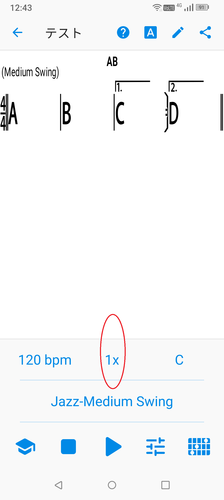
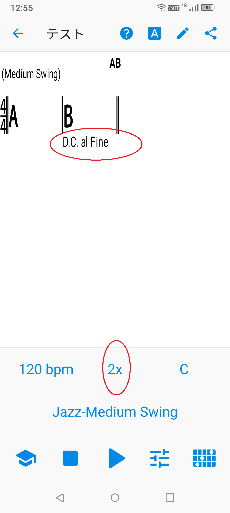
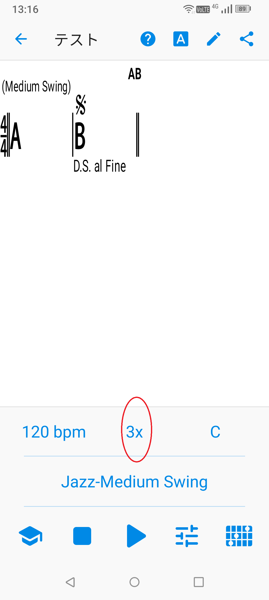

# iRealPro
[戻る](./README.md)  
繰り返し記号を使えば、楽譜が簡潔になり、暗譜もしやすくなる。

## 1.繰り返し記号
|No.|ボタン|メモ|
|---|---|---|
|1|┌1.|1回目だけ、反復記号（右）まで進んで、曲の最初または反復記号（左）まで戻る。|
|2|┌2.|2回目に┌1.のところにきたら、ここまで飛ぶ。|
|3|┌3.|3回目に┌1.のところにきたら、ここまで飛ぶ。|
|4|coda|ダ・カーポ、ダル・セーニョで戻ったあと、次のヴィーデまたはコーダ（集結部）まで飛ぶ。|
|5|segno|ダル・セーニョでここまで戻る|
|6|fermata|「D.C.」や「D.S.」で戻ったあと、演奏終了。「Fine」と、「複重線上のフェルマータ」は同じ意味。|
|7|END||
|8|D.C. al Coda|曲の最初まで戻り、|
|9|D.C. al Fine|曲の最初まで戻り、Fineで終わる|
|10|D.C al 1st End.|曲全体の繰り返しの1回目で曲の最初まで戻る|
|11|D.C. al 2nd End.|曲全体の繰り返しの2回目で曲の最初まで戻る|
|12|D.C. al 3rd End.|曲全体の繰り返しの3回目で曲の最初まで戻る|
|13|D.S. al Coda||
|14|D.S. al Fine|セーニョまで戻り、Fineで終わる|
|15|D.S. al 1st End.|曲全体の繰り返しの1回目でセーニョまで戻る|
|16|D.S. al 2nd End.|曲全体の繰り返しの2回目でセーニョまで戻る|
|17|D.S. al 3rd End.|曲全体の繰り返しの3回目でセーニョまで戻る|
|18|Fine|演奏終了|
|19|Break||
|20|3x||
|21|4x||
|22|5x||

## 2.繰り返し記号による進行の例
[hoge][1]  
[1]:irealb://Simile%3DComposer%20Unknown%3D%3DMedium%20Swing%3DC%3D0%3D1r34LbKcu7%5BAXyQ%7CBXyQKcl%20LZ%20%20xLZCXyQ%7CDXyQ%7CXyQr%7CXyQ%20%7C%20%3DJazz-Medium%20Swing%3D120%3D1  
  
|No.|Mark|images|Memo|
|---|---|---|---|
|1|<a href="irealb://Simile%3DComposer%20Unknown%3D%3DMedium%20Swing%3DC%3D0%3D1r34LbKcu7%5BAXyQ%7CBXyQKcl%20LZ%20%20xLZCXyQ%7CDXyQ%7CXyQr%7CXyQ%20%7C%20%3DJazz-Medium%20Swing%3D120%3D1">小節のシミレ</a>||再生順： 「ABBB CDCD」 １小節を繰り返すには「%」、２小節を繰り返すには「x」。「%」は、1小節4マスの場合、2マス目に置くと収まりがよい。「x」は1小節目の最後のマス（拍）に置く。|
|2|リピート||再生順： 「ABAB ABAB ABAB」 リピート（右）まで行くと、リピート（左）に戻る。曲の最初に戻る場合は、リピート（左）は省略されることもある。「3x」により曲が3回繰り返される。 これにより、結果的に「AB」が合計6回演奏される。|
|2|１番かっこ、２番かっこ||再生順： 「ABC ABD」 最初は１番かっこのリピートまで演奏され、曲の最初に戻り、２回目に１番かっこの場所まできたら、２番かっこが演奏される。「1x」により曲は繰り返されない。 これにより、結果的に「ABC ABD」が1回演奏される。|
|3|ダ・カーポ D.C. al Fine||再生順： 「ABAB ABAB」 ダ・カーポにより「B」のあと曲の最初まで戻り、「2x」により曲が2回繰り返される。 これにより、結果的に「AB」が4回演奏される。 なお、「3x」とすれば、No.1と同等になるが、リピート（左）は曲の最初に戻る場合省略されるが、本来はリピート（左）まで戻る。D.C. は曲の最初に戻る。曲の途中まで戻る場合はダル・セーニョを使う。|
|4|ダル・セーニョ D.S. al Fine||再生順： 「ABB ABB ABB」 ダル・セーニョにより「B」のあとセーニョまで戻り、「3x」により曲が3回繰り返される。 これにより、結果的に「ABB」が3回演奏される。|
|5||||
|6||||
|7||||
|8||||
|9||||
|10||||

1. [ABAC](irealb://RepeatMark01%3DComposer%20Unknown%3D%3DMedium%20Swing%3DC%3D0%3D1r34LbKcu7%5BT44AXyQ%7CN1BXyQ%7D%7CN2CXyQZ%20%3DJazz-Medium%20Swing%3D120%3D3)
2. ABA
3. ABACA
4. [ABACAD](irealb://RepeatMark04%3DComposer%20Unknown%3D%3DMedium%20Swing%3DC%3D0%3D1r34LbKcu7%5BT44AXyQ%7CN1BXyQ%7D%7CN2CXyQ%7D%7CN3DXyQ%5D%20%3DJazz-Medium%20Swing%3D120%3D1)
5. [ABACADA]()
6. ABA
7. ABAC ABAC ABAC ABAD
8. 
  
  
[戻る](./README.md) 