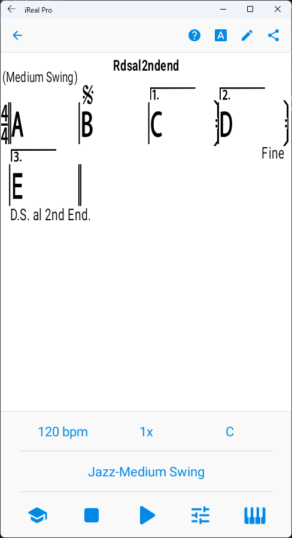

# iRealPro
[戻る](./README.md)  
繰り返し記号を使えば、楽譜が簡潔になり、暗譜もしやすくなる。

## 1.繰り返し記号
|No.|ボタン|メモ|
|---|---|---|
|1|┌1.|1回目だけ、反復記号（右）まで進んで、曲の最初または反復記号（左）まで戻る。|
|2|┌2.|2回目に┌1.のところにきたら、ここまで飛ぶ。|
|3|┌3.|3回目に┌1.のところにきたら、ここまで飛ぶ。|
|4|coda|１回目は素通りし、リピートやダ・カーポ、ダル・セーニョで戻ったあと、２回目にここまで来たら、次のヴィーデ（vide）またはコーダ（集結部）まで飛ぶ。|
|5|segno|ダル・セーニョで、ここまで戻る|
|6|fermata|「D.C.」や「D.S.」で戻ったあと、演奏終了。「Fine」と、「複重線上のフェルマータ」は同じ意味。|
|7|END|https://technimo.helpshift.com/hc/en/3-ireal-pro/faq/124-end-symbol/?p=android|
|8|D.C. al Coda|曲の最初まで戻ってコーダで飛ぶ|
|9|D.C. al Fine|曲の最初まで戻ってFineで終わる|
|10|D.C al 1st End.|曲の最初まで戻って1番かっこに行ってFineで終わる|
|11|D.C. al 2nd End.|曲の最初まで戻って2番かっこに行ってFineで終わる|
|12|D.C. al 3rd End.|曲の最初まで戻って3番かっこに行ってFineで終わる|
|13|D.S. al Coda|セーニョまで戻ってコーダで飛ぶ   |
|14|D.S. al Fine|セーニョまで戻ってFineで終わる|
|15|D.S. al 1st End.|セーニョまで戻って1番かっこに行ってFineで終わる|
|16|D.S. al 2nd End.|セーニョまで戻って2番かっこに行ってFineで終わる|
|17|D.S. al 3rd End.|セーニョまで戻って3番かっこに行ってFineで終わる|
|18|Fine|演奏終了|
|19|Break|ドラムを鳴らさない（ピアノは鳴る）|
|20|N.C.|ピアノを鳴らさない（ドラムは鳴る）|
|21|●縦長楕円（表記は「W」）|分数コードの分子にして、分母のルート音だけを鳴らす。|
|22|3x|リピート記号で、2回ではなく3回繰り返す。リピート記号（右）の小節の最後のマスに置く。|
|23|4x|リピート記号で、2回ではなく4回繰り返す。|
|24|5x|リピート記号で、2回ではなく5回繰り返す。|

## 2.繰り返し記号による進行の例
「Mark」のリンク先のHTMLファイルは、「Download raw file」で保存すれば使えます。
|No.|Mark|images|Memo|
|---|---|---|---|
|1|[小節のシミレ](./html/Simile.html)||再生順： 「ABBB CDCD」 １小節を繰り返すには「%」、２小節を繰り返すには「x」。「%」は、1小節4マスの場合、2マス目に置くと収まりがよい。「x」は1小節目の最後のマス（拍）に置く。|
|2|[N.C.（ノー・コード）](./html/Metronome.html)||再生順： 「N.C.」が４小節 「N.C.」は「ノー・コード」のことで、音階楽器の音が鳴らない。いっぽうでドラムなどリズム楽器は鳴るので、結果的にメトロノームにできる。|
|3|[反復記号](./html/Repeat.html)||再生順： 「ABAB」が3x 反復記号（右）まで行くと、反復記号（左）に戻る。曲の最初に戻る場合は、反復記号（左）は省略されることもある。「3x」により曲が3回繰り返される。 これにより、結果的に「AB」が合計6回演奏される。|
|4|[3x](./html/Repeat3times.html)||再生順： 「ABC BC BC D」 反復記号（右）まで行くと、反復記号（左）に戻る。反復記号（右）の下に「3x」とあることで、「BC」を3回繰り返す。|
|5|[１番かっこ、２番かっこ](./html/1stEnding2ndEnding.html)||再生順： 「ABC BD BE 」が3x 最初は１番かっこの反復記号（右）まで演奏され、反復記号（左）に戻り、２回目に１番かっこの場所まできたら、２番かっこに飛び、反復記号（右）まで演奏されたら反復記号（左）に戻り、３回目に１番かっこの場所まできたら、３番かっこに飛ぶ。「3x」により、「ABC BD BE」が3回演奏される。|
|6|[コーダ](./html/Coda.html)||再生順： 「ABC ABC ABD」 曲の繰り返しが3回に設定してあり、3回目の繰り返し（最後の繰り返しの時）で、コーダの場所からもうひとつのコーダの場所まで飛ぶ（B -> D）。繰り返しの１回目や２回目ではコーダは無視される。コーダを入れる場所は、Bは最後のマス（拍）、Dは小節の前のマス（拍）または１コマ（拍）目でも可。|
|7|[D.C. al Coda](./html/DCalCoda.html)||再生順： 「ABCD ABE」 D.C. で曲の最初に戻り、コーダの場所からもうひとつのコーダの場所まで飛ぶ。|
|8|[D.C. al Fine](./html/Fine.html)||再生順： 「ABCAB」が3x D.C. で曲の最初に戻り、Fineのところで終わる。|
|9|[D.C. al 1st End.](./html/Rdcal1stend.html)||再生順： 「AB AC AD AB」 D.C. で曲の最初に戻り、１番かっこを演奏してFineで終わる。|
|10|[D.C. al 2nd End.](./html/Rdcal2ndend.html)||再生順： 「AB AC AD AC」 D.C. で曲の最初に戻り、２番かっこを演奏してFineで終わる。|
|11|D.C. al 3rd End.||楽譜例がつくれず。|
|12|[D.S. al Coda](./html/Rdsalcoda.html)||再生順： 「ABCD BCDE」 D.C. でセーニョまでもどり、コーダの場所からもうひとつのコーダの場所まで飛ぶ。|
|13|[D.S. al Fine](./html/Rdsalfine.html)||再生順： 「ABCD BC」 D.C. でセーニョまでもどり、Fineで終わる。|
|14|[D.S. al 1st End.](./html/Rdsal1stend.html)||再生順： 「ABC ABD ABE BC」 D.C. でセーニョまでもどり、１番かっこを演奏してFineで終わる。|
|15|[D.S. al 2nd End.](./html/Rdsal2ndend.html)||再生順： 「ABC ABD ABE BD」 D.C. でセーニョまでもどり、２番かっこを演奏してFineで終わる。|
|16|D.S. al 3rd End.||楽譜例が作れず。|

  
  
[戻る](./README.md) 